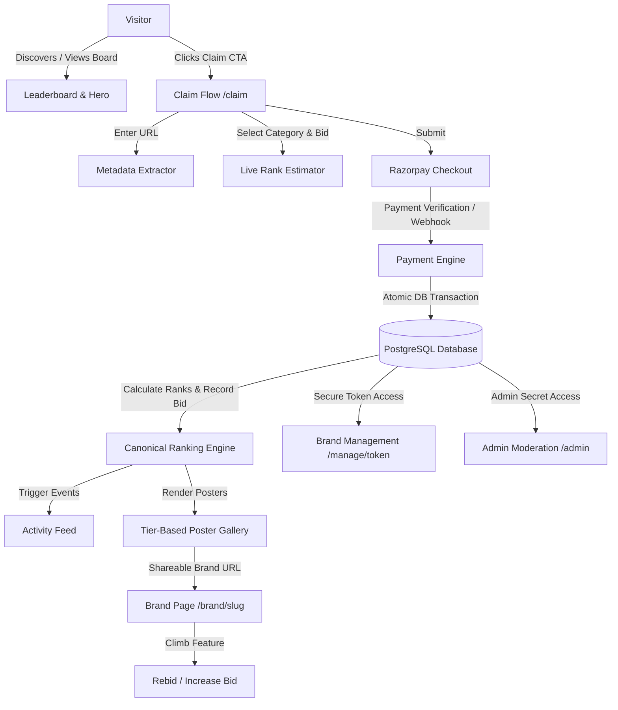

# Implementation Plan: BrandBid.me — Full Product Implementation

BrandBid.me is an internet-native public leaderboard where brands and startups compete for ranking based on how much they pay. The product follows the fundamental rule: **the higher the verified paid bid, the higher the leaderboard position and the more prestigious the visual poster treatment**.

This plan outlines the complete production implementation based on `PRD.md`, `DESIGN.md`, and `TECH-STACK.md`.

---

## User Review Required

> [!IMPORTANT]
> **No User Accounts for Public Users**: In strict accordance with the PRD and Design specs, there are no signup/login/passwords for public users. Brand owners receive a cryptographically secure tokenized management link (`/manage/[token]`) upon successful payment.
> 
> **Database & Local Compatibility**: We will configure Drizzle ORM with support for PostgreSQL (Supabase) via `DATABASE_URL`, along with local SQLite/LibSQL fallback so the application runs completely out-of-the-box in local development while remaining 100% production-ready for Supabase PostgreSQL migrations.
> 
> **Razorpay Integration & Simulation Mode**: We will implement full Razorpay order creation, SDK checkout, and server-side signature/webhook verification. For local testing without active Razorpay live credentials, we will include a test checkout simulation mode that triggers the exact same server-side verification and idempotent transaction flow.

---

## Proposed Architecture & Key Components



---

## Proposed Changes

### 1. Core Foundation & Database (`lib/db/`, `drizzle/`)

#### [NEW] `package.json`
- Next.js 15/16 App Router, React 19, TypeScript, Tailwind CSS, Lucide React / Tabler icons, Drizzle ORM, Razorpay SDK, Zod, Vitest.

#### [NEW] [schema.ts](file:///c:/Users/Workf/Downloads/sohil/brand/lib/db/schema.ts)
- `brands`: `id`, `website_url`, `canonical_url`, `slug`, `name`, `category`, `logo_url`, `description`, `total_bid`, `status` (`published`, `pending`, `suspended`), `management_token_hash`, `created_at`, `updated_at`.
- `payments`: `id`, `brand_id`, `provider_payment_id` (UNIQUE for idempotency), `provider_order_id`, `amount`, `currency`, `status` (`pending`, `verified`, `failed`), `created_at`, `verified_at`.
- `bid_history`: `id`, `brand_id`, `payment_id`, `amount_added`, `previous_total`, `new_total`, `previous_rank`, `new_rank`, `created_at`.
- `activity`: `id`, `brand_id`, `event_type` (`brand_entered`, `rank_climbed`, `bid_increased`, `became_number_one`), `metadata` (JSON), `created_at`.

#### [NEW] [seed.ts](file:///c:/Users/Workf/Downloads/sohil/brand/lib/db/seed.ts)
- Seeds 20+ realistic fictional tech brands with realistic bids (e.g. ₹65,000 down to ₹1,000), covering:
  - #1 Gold Legendary (`Synthetix AI`)
  - #2 Silver Challenger (`Veloce Dev`)
  - #3 Bronze Contender (`HyperFlow SaaS`)
  - #4–10 Elite (`OmniTrack`, `KubeCraft`, `PayZen`, `RelayHQ`, `ZenithOS`, `PulseGraph`, `DraftWave`)
  - #11–25 Featured brands across all categories
  - #26–50 Standard & #51+ Compact brands

---

### 2. Business Logic & Engines (`lib/`)

#### [NEW] [ranking-engine.ts](file:///c:/Users/Workf/Downloads/sohil/brand/lib/ranking/ranking-engine.ts)
- `calculateRankings(brands)`: Sorts strictly by `total_bid DESC`, with deterministic tie-breaking: earlier verified payment date wins.
- `getBrandRank(brandId)`: Gets accurate 1-based rank.
- `getNextRank(currentBid)`: Calculates the minimum bid needed to overtake the next spot ("Only ₹X to climb to #Y").
- `estimateRankForBid(bidAmount)`: Calculates prospective rank for a new submission in real-time.

#### [NEW] [razorpay.ts](file:///c:/Users/Workf/Downloads/sohil/brand/lib/payments/razorpay.ts)
- Razorpay order creation, HMAC SHA-256 signature verification, idempotent payment recording inside an atomic database transaction.

#### [NEW] [extractor.ts](file:///c:/Users/Workf/Downloads/sohil/brand/lib/metadata/extractor.ts)
- Best-effort website title, description, favicon, and Open Graph image fetcher with strict timeout, SSR error handling, and graceful fallback.

#### [NEW] [normalize.ts](file:///c:/Users/Workf/Downloads/sohil/brand/lib/url/normalize.ts)
- Sensible canonical URL normalization (protocol, www, trailing slash, path lowercase) and slug generation.

#### [NEW] [tokens.ts](file:///c:/Users/Workf/Downloads/sohil/brand/lib/security/tokens.ts)
- Cryptographic token generation (`crypto.randomBytes`) and SHA-256 hash validation for `/manage/[token]`.

---

### 3. Design System & Posters (`components/`, `app/globals.css`)

#### [NEW] `globals.css` & Design System
- Warm off-white background `#F7F6F2`, primary near-black `#111111`, muted gray `#6B6B67`, neutral border `#D8D6D0`.
- Metallic accents: Gold `#E7B93C`, Silver `#BFC3C7`, Bronze `#B8794B`, Punch accent `#FF5C35`.
- Typography hierarchy: Geist / Inter / Space Grotesk display headers + Geist Mono numeric bids.
- Strict anti-pattern enforcement: No generic SaaS cards, no heavy pill buttons, no excessive shadows.

#### [NEW] Poster Components (`components/posters/`)
- `BrandPoster.tsx`: Main dispatcher selecting layout based on rank tier and template style.
- `LegendaryPoster.tsx`: **#1 Legendary Tier** (Grand scale, gold borders/accents, prominent crown / #01 typography, gold badge, glowing status).
- `ChallengerPoster.tsx`: **#2 Challenger Tier** (Silver accent, large layout, #02 typography).
- `ContenderPoster.tsx`: **#3 Contender Tier** (Bronze accent, large layout, #03 typography).
- `ElitePoster.tsx`: **#4–10 Elite Tier** (Template variants: Typography dominant, Logo dominant, Editorial).
- `FeaturedPoster.tsx`: **#11–25 Featured Tier** (Clean editorial poster).
- `StandardPoster.tsx`: **#26–50 Standard Tier** (Compact poster).
- `BoardPoster.tsx`: **#51+ Board Tier** (Minimal listing row / mini-card).

---

### 4. Public Pages & Interactive Experiences (`app/`)

#### [NEW] `app/page.tsx` (Homepage)
- Minimalist header with `BRANDBID.ME` and `CLAIM YOUR SPOT →`.
- High-impact sparse Hero (`HOW HIGH CAN YOUR BRAND CLIMB?`, total bid volume counter, active brand count).
- Live Activity Ticker (Real-time updates of bids, ranking jumps, new entries).
- Category filter & search.
- The Digital Exhibition Leaderboard gallery displaying all active brand posters with rank animations.
- "Next Rank" prompt & Bottom Claim Banner.

#### [NEW] `app/claim/page.tsx` (Claim Flow)
- 30-second frictionless claim form:
  - Step 1: Website URL input with automatic metadata preview.
  - Step 2: Category selection.
  - Step 3: Bid amount with **Live Rank Estimator** ("This bid puts you at #4!").
  - Step 4: Razorpay Checkout modal with instant confirmation.

#### [NEW] `app/brand/[slug]/page.tsx` (Public Brand Detail Page)
- Dedicated screenshot-friendly poster presentation.
- Current rank badge, total bid, category, direct website link with click counter.
- "Want to climb?" next-rank progress banner with one-click increase bid CTA.
- Share buttons (X/Twitter, LinkedIn, Copy Link with toast).
- Dynamic Open Graph image generation (`opengraph-image.tsx`).

#### [NEW] `app/success/page.tsx` (Payment Confirmation)
- Restrained, celebratory post-payment reveal (`BID CONFIRMED. YOU'RE #17.`).
- Management token link presentation with copy button.
- Instant links to view poster on the board and share on social media.

#### [NEW] `app/manage/[token]/page.tsx` (Tokenized Brand Management)
- Edit website title, description, category, logo.
- Rebid / Increase Bid tool with live rank recalculation.
- Full bid history audit trail.

#### [NEW] `app/admin/page.tsx` (Admin Panel)
- Platform summary metrics (Total bid volume, total brands, conversion rates, verified payments).
- Brand moderation table (Publish, Suspend, Delete, Edit).
- Payment inspection log with Razorpay transaction IDs.
- Activity log monitor.

---

### 5. API Endpoints (`app/api/`)

- `GET /api/leaderboard`: Returns ranked brands, category filters, and platform totals.
- `GET /api/brands/[slug]`: Returns individual brand, rank, and climbing gap.
- `POST /api/metadata`: Extracts website metadata with timeout and fallback.
- `POST /api/payments/create`: Validates submission and creates Razorpay order.
- `POST /api/payments/verify`: Verifies Razorpay payment signature, executes atomic DB transaction to update `brands`, `payments`, `bid_history`, `activity`, and recalculates ranks.
- `POST /api/payments/webhook`: Idempotent Razorpay webhook listener.
- `POST /api/bids/increase`: Handles rebids for existing brands.
- `GET|PUT /api/manage/[token]`: Fetches / updates brand via token hash.
- `GET /api/activity`: Returns recent platform activity items.
- `GET|POST /api/admin/*`: Admin stats & moderation actions.
- `POST /api/analytics`: Ingests frontend user interaction events.

---

### 6. Automated Testing (`tests/`)

- `tests/ranking.test.ts`: Verifies ranking calculation, bid sorting, and deterministic tie-breaking.
- `tests/payments.test.ts`: Tests payment idempotency (duplicate webhook calls don't double-count bids) and atomic balance updates.
- `tests/normalization.test.ts`: Tests URL canonicalization and slugification.

---

## Verification Plan

### Automated Tests
- Run `npm test` using Vitest to execute the test suite:
  ```powershell
  npm test
  ```

### Manual Verification Flow in Browser
1. **Homepage Load**:
   - Verify design aesthetic: warm off-white `#F7F6F2`, dark typography, thin borders, generous whitespace.
   - Verify the visual hierarchy of posters: #1 Gold Legendary vs #2 Silver vs #3 Bronze vs #4-10 Elite vs #11-25.
2. **Claim Flow (`/claim`)**:
   - Enter a test URL (e.g. `https://linear.app` or `https://github.com`).
   - Verify metadata is fetched automatically and populates title/description.
   - Select category and type bid amounts (e.g. ₹45,000) — verify the Live Rank Estimator dynamically shows prospective rank.
   - Proceed to checkout and complete payment verification.
3. **Leaderboard & Ranking Updates**:
   - Verify the brand immediately appears in its correct rank on the leaderboard.
   - Verify lower-ranked brands shift down automatically.
   - Verify activity ticker shows the new entry event.
4. **Brand Page (`/brand/[slug]`)**:
   - Navigate to the newly published brand page.
   - Test "Want to climb?" distance indicator and Increase Bid flow.
   - Test Social Share and Copy Link buttons.
5. **Brand Management (`/manage/[token]`)**:
   - Access the management page with the generated token.
   - Update brand details and increase bid; verify updates reflect on the leaderboard.
6. **Admin Panel (`/admin`)**:
   - Moderate a brand (suspend/publish) and verify status update on the public board.
   - Inspect payment transactions and total bid volume stats.
7. **Mobile Responsiveness**:
   - Test viewport down to 375px (iPhone width) and verify strong single-column poster layout.

---

*Once approved, implementation will proceed systematically phase by phase.*
